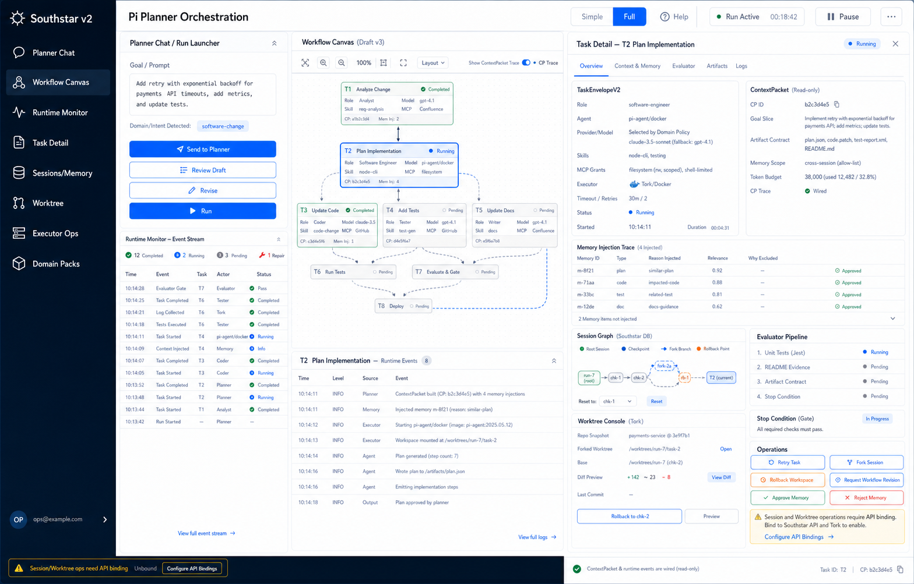
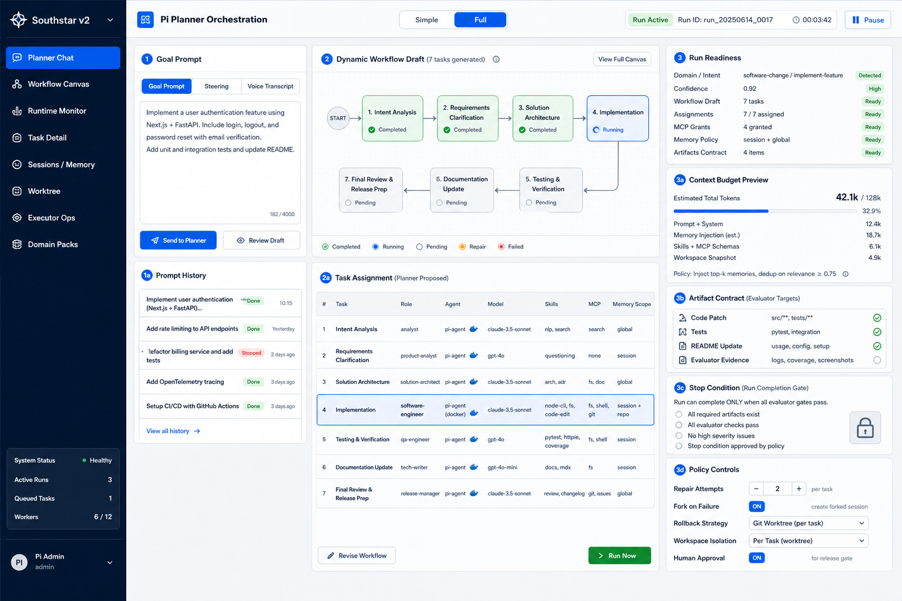
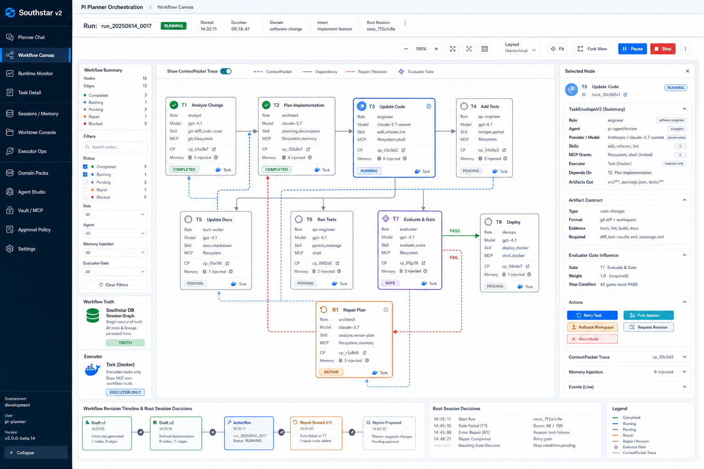
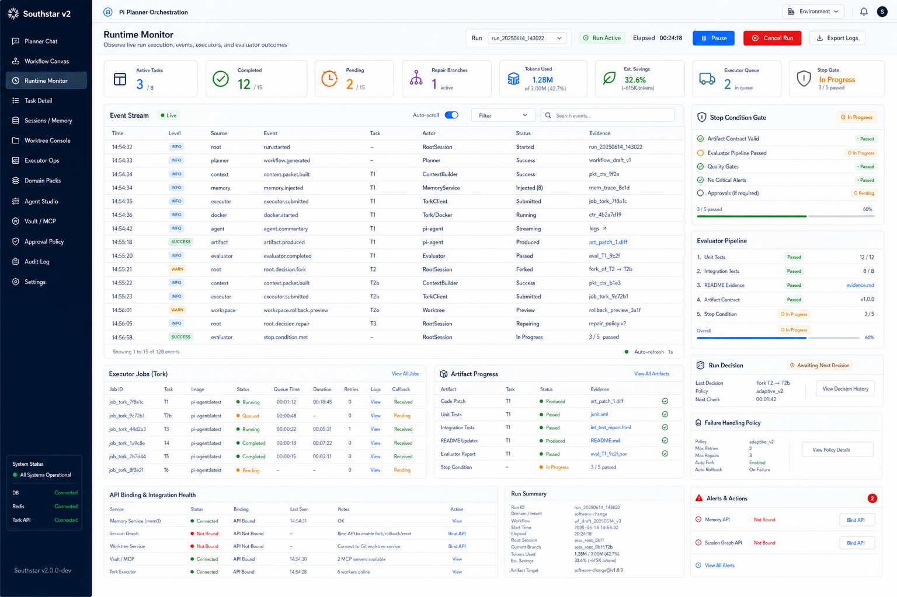
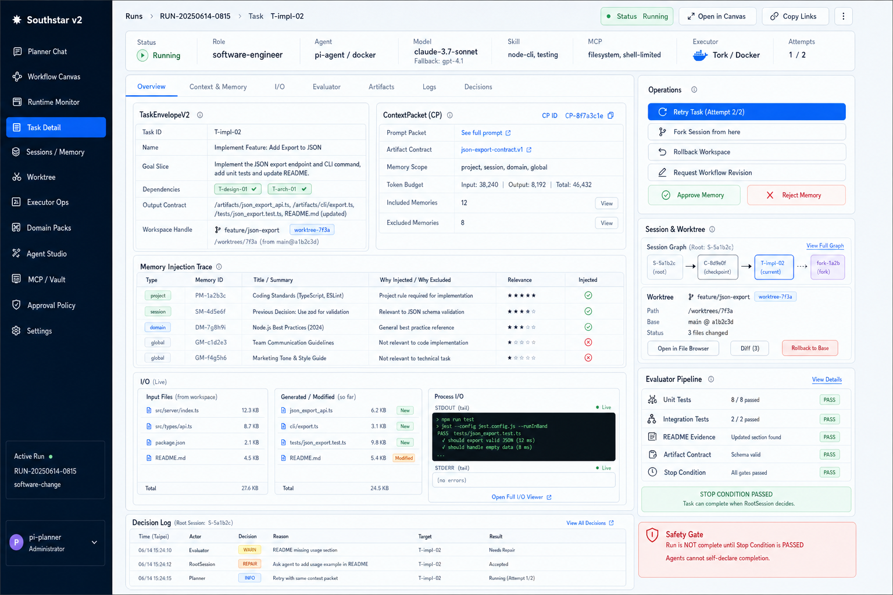
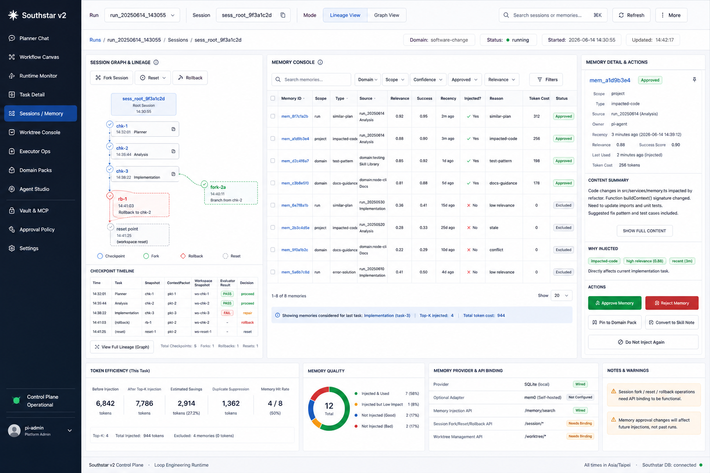
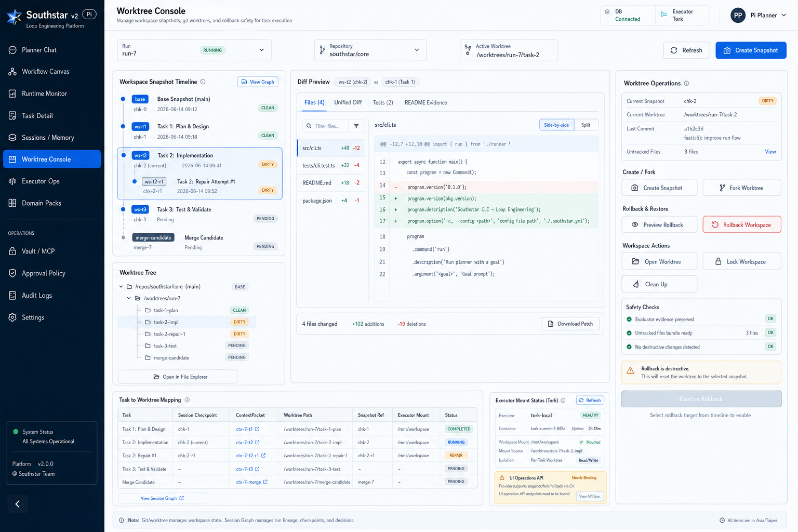
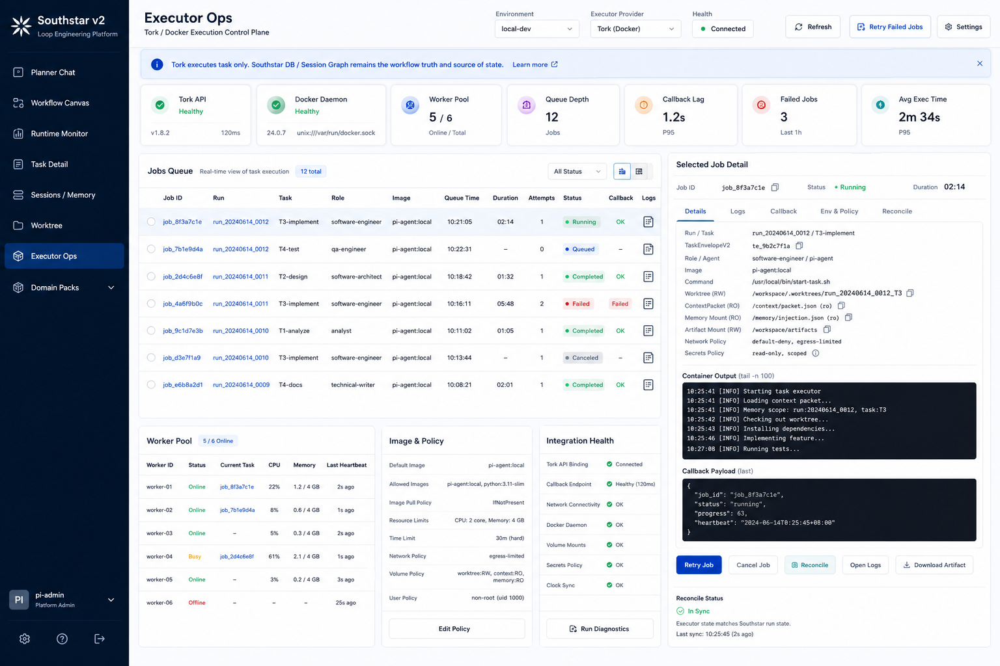
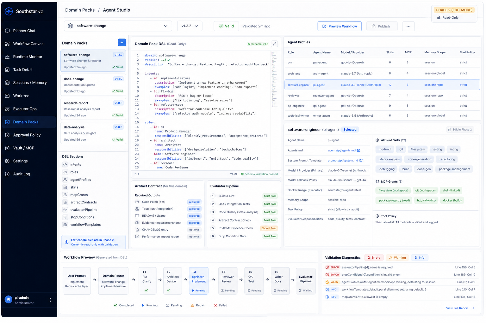
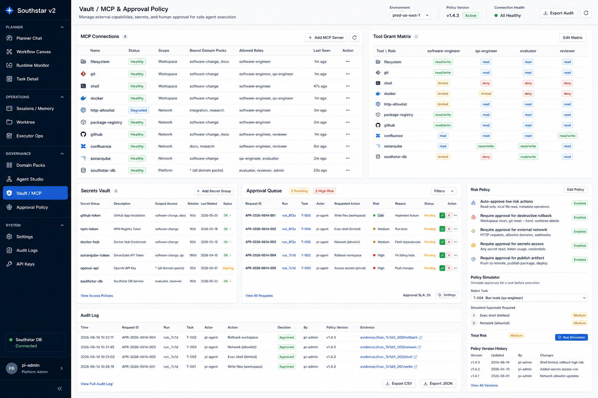

# Southstar Loop Engineering UI + Runtime Control Plane 設計文件

日期：2026-06-14

## 1. 目標

本設計把 Southstar v2 從「已有可測試 runtime 與靜態 UI shell」推進為「使用者輸入 prompt 後，UI 與 runtime 合作完成有意義成品」的 Loop Engineering control plane。

第一階段目標不是先做完整低程式碼 Agent Studio，而是先把 prompt 到 artifact 的閉環做實：

- 使用者在 UI 輸入 goal prompt、steering 或 voice transcript。
- Southstar 自動判斷 domain/intent。
- Domain Pack 驅動 dynamic workflow generation，不再固定四個 task。
- 每個 task materialize 成可追蹤的 `TaskEnvelopeV2`，包含 role、agent profile、provider/model、skills、MCP grants、memory scope、workspace handle、artifact contract、evaluator pipeline。
- 每次 agent 執行前產生 `ContextPacket`，UI 可解釋 memory 為什麼被注入、為什麼被排除、消耗多少 token。
- Docker/Tork 執行 task，但 Tork 只當 executor；Southstar DB、Session Graph、Workflow Snapshot 才是 workflow truth。
- artifact 產生後由 evaluator pipeline 驗收。
- 驗收失敗時 RootSession 可依 policy retry、fork session、rollback workspace、或要求 workflow revision。
- session 具備 checkpoint/fork/reset/rollback lineage；software workspace 由 Git/worktree 做 snapshot/fork/rollback。
- 只有 stop condition 通過，run 才能完成；agent 自述完成不算完成。

本文件整合兩份既有設計：

- `2026-06-12-southstar-v2-operations-ui-api-executor-design.zh.md`：v2 UI/API/executor 操作閉環。
- `2026-06-13-southstar-domain-pack-context-memory-session-design.zh.md`：Domain Pack、ContextPacket、Memory、SessionGraph、Worktree、Dynamic Workflow runtime。

## 2. 非目標

- 不在第一階段做完整 visual DSL editor 或任意 workflow script execution。
- 不讓 Tork、Git、mem0、LangGraph 或 UI 本身成為 canonical workflow truth。
- 不把完整 LLM transcript 當 long-term memory。
- 不在第一階段做 production auth、多租戶、遠端 sandbox fleet。
- 不做 marketing landing page；第一屏就是操作台。
- 不以靜態圖片作為產品 UI；圖片是設計基準，實作必須使用 code-native UI 與真資料。

## 3. 視覺基準

本設計以第二張 `Task Detail / Session / Memory / Worktree` 狀態圖為基準，展開成完整頁面組。

### 3.1 Baseline



設計語言：

- 深色左側 rail：`#071827`。
- 工作區背景：`#f7f9fc`。
- 白色 panel、細 `#dbe3ee` 邊框、8px radius。
- Inter/system UI，密集但可讀的操作台 typography。
- 狀態色：blue `#2563eb`、cyan `#0891b2`、green `#16a34a`、amber `#d97706`、red `#dc2626`。
- 不使用 marketing hero、裝飾 gradient、orb、bokeh、過度圓角 pill。
- Panel 是工作面，不是裝飾卡片；避免卡片套卡片。

## 4. 產品形態

採 `Agent Studio + Runtime Control Plane`，但第一階段落地順序是 `Control Plane First, Studio Incremental`。

原因：

- 目前最大風險不是 DSL 編輯器不夠漂亮，而是 prompt run 是否能真的完成成品。
- Memory、SessionGraph、Worktree、Evaluator、Stop Condition 需要先接成可觀測與可操作的 runtime loop。
- Domain Pack/Agent Studio 第一階段以 read-only、validation、workflow preview 為主，確保 role/agent/model/skill/MCP/evaluator 可追蹤；完整編輯器放第二階段。

## 5. 核心架構

```text
Next UI
  -> Southstar Runtime Server
      -> Intent Router
      -> DomainPack Registry
      -> Dynamic Workflow Generator
      -> Workflow Plan Validator
      -> Run Store / Event Store / Read Models
      -> Context Builder
          -> Memory Provider
          -> SessionGraph Provider
          -> Workspace Snapshot Provider
          -> Skill / MCP Resolver
      -> TaskEnvelopeV2 Materializer
      -> ExecutorProvider
          -> Tork / Docker
      -> Evaluator Pipeline
      -> RootSession Recovery Policy
          -> retry / fork / rollback / replan
      -> Stop Condition
```

Canonical truth：

- Workflow truth：Southstar DB + Workflow Snapshot + SessionGraph。
- Task execution truth：Southstar task/event/resource records。
- Executor truth：Tork job/container status, only as execution projection。
- Workspace truth：Git/worktree snapshots for software domain。
- Completion truth：EvaluatorPipelineResult + StopConditionResult。

## 6. Prompt 到完成品資料流

### 6.1 Run 前

1. UI 在 Planner Chat 接收 prompt。
2. `POST /api/v2/planner/drafts` 建立 draft。
3. IntentRouter 判斷 domain/intent。
4. DomainPackRegistry 載入 domain pack。
5. DynamicWorkflowGenerator 產生 `WorkflowGenerationPlan`。
6. Validator 檢查 task、role、agent profile、model、skill、MCP、artifact contract、evaluator、stop condition 都在 domain pack 允許範圍內。
7. UI 顯示 workflow draft、task assignment、context budget、artifact contract、stop condition 與 policy controls。
8. 使用者按 Run 後，`POST /api/v2/run-goal` 或 `POST /api/v2/runs` 建立 run。

### 6.2 Task 執行前

1. Runtime 對每個 runnable task 建立 session checkpoint。
2. Workspace provider 建立或解析 workspace snapshot/worktree handle。
3. ContextBuilder 搜尋 memory candidates。
4. Memory ranker/selector 決定 injected/excluded memories。
5. Runtime 持久化 `ContextPacket` 與 `MemoryInjectionTrace`。
6. TaskEnvelopeV2 materializer 產生 task 的完整 execution contract。
7. ExecutorProvider submit task 到 Tork/Docker。

### 6.3 Task 執行中

1. Tork 啟動 Docker container。
2. Container 只讀掛載 ContextPacket、memory trace、skill snapshot、MCP grants；可寫掛載 workspace/artifact output。
3. Agent 產出 artifact、logs、events。
4. Tork callback 回到 Southstar Runtime Server。
5. Runtime ingestion 將 executor state reconcile 到 Southstar event/resource store。

### 6.4 驗收與修復

1. EvaluatorPipeline 驗收 artifact。
2. StopCondition 檢查所有 gate。
3. 若 gate 通過，run 完成。
4. 若 gate 失敗，RootSession 根據 policy 做：
   - retry same task；
   - fork session；
   - rollback workspace；
   - request workflow revision；
   - pause for approval。
5. 每次 decision 都寫入 session graph、runtime event、decision log。

## 7. 頁面設計

### 7.1 Planner Chat / Run Launcher



責任：

- prompt/steering/voice transcript 的唯一 command surface。
- 顯示 domain/intent detection。
- 顯示 dynamic workflow draft，不顯示固定四 task。
- 顯示 task assignment：task、role、agent、model、skills、MCP、memory scope。
- 顯示 context budget、artifact contract、stop condition 與 recovery policy。
- 讓使用者 review/revise/run。

必須接上的 runtime：

- `createPlannerDraft`
- `createRun` / `runGoal`
- `steerRun`
- `voiceCommand`
- workflow draft read model
- domain pack validation result

第一階段互動：

- Send to Planner：產生 draft。
- Review Draft：展開 draft details。
- Revise：送出 revision prompt，產生新 draft version。
- Run：建立 run，跳到 Runtime Monitor。

### 7.2 Workflow Canvas



責任：

- 視覺化 dynamic workflow DAG。
- 顯示 dependency、repair/revision loop、evaluator gate、ContextPacket trace。
- 顯示 workflow truth 與 executor 邊界。
- 選中 node 後開啟 TaskEnvelope/ContextPacket/Memory/Event 摘要。

必須接上的 runtime：

- workflow canvas read model
- task list/detail
- task dependencies
- workflow revision timeline
- root session decisions
- ContextPacket trace overlay

第一階段互動：

- Show ContextPacket Trace。
- Fit/Zoom/Layout。
- Fork View。
- Selected node actions：Retry、Fork Session、Rollback Workspace、Request Revision。

### 7.3 Runtime Monitor



責任：

- 觀測 run 從 `run.started` 到 `stop.condition.met` 的完整事件流。
- 讓使用者知道接口是否真接上，包括 memory、session graph、worktree、Tork、Vault/MCP。
- 顯示 evaluator pipeline 與 stop condition 進度。
- 顯示 artifact progress 與 executor jobs。

必須接上的 runtime：

- SSE `/api/v2/runs/:id/events`
- `getRun`
- `listTasks`
- `listArtifacts`
- executor jobs read model
- integration health read model

第一階段互動：

- Pause/Resume/Cancel run。
- Export logs。
- Filter/search events。
- Open job logs。
- Bind missing API 入口只做狀態導引，不在第一階段做完整設定 wizard。

### 7.4 Task Detail



責任：

- 單一 task 的 drilldown。
- 呈現 `TaskEnvelopeV2`、`ContextPacket`、Memory Injection Trace、I/O、logs、evaluator、artifacts、decisions。
- 提供 task-level repair/fork/rollback/revision 操作。
- 顯示 safety gate：agent 不可 self-declare completion。

必須接上的 runtime：

- `getTask`
- `getTaskEnvelope`
- context packet read model
- memory injection trace read model
- task I/O artifact read model
- evaluator pipeline result
- session/worktree operation APIs

第一階段互動：

- Retry Task。
- Fork Session from here。
- Rollback Workspace。
- Request Workflow Revision。
- Approve/Reject Memory。

### 7.5 Sessions / Memory



責任：

- 管理 session graph lineage。
- 管理 memory candidates、injected/excluded trace、approval state、token impact。
- 顯示 checkpoint/fork/reset/rollback 不是測試 provider 而是 UI 可操作能力。

必須接上的 runtime：

- session graph resources read model
- memory list/search read model
- memory approval operations
- session fork/reset/rollback operations
- token efficiency metrics

Memory provider policy：

- 第一階段保留 SQLite provider 作為 wired provider。
- 可加 `MemoryProvider` adapter boundary 以支援 mem0。
- mem0 只能做 provider，不可取代 Southstar 的 approval、ranking、trace、audit、ContextPacket 選擇權。

第一階段互動：

- Search memories。
- Filter by domain/scope/confidence/approved/relevance。
- Approve/Reject Memory。
- Do Not Inject Again。
- Fork Session。
- Reset。
- Preview Rollback。

### 7.6 Worktree Console



責任：

- 管理 software workspace snapshots。
- 顯示 Git/worktree fork、diff、rollback preview、task mapping。
- 明確拆分：Git/worktree 管 workspace state；SessionGraph 管 run lineage。

必須接上的 runtime：

- workspace snapshot read model
- worktree fork API
- diff preview API
- rollback preview API
- rollback confirm API
- task-to-worktree mapping
- executor mount status

第一階段互動：

- Create Snapshot。
- Fork Worktree。
- Preview Rollback。
- Rollback Workspace。
- Open Worktree。
- Clean Up。
- Lock Workspace。

安全規則：

- Rollback 是破壞性操作，必須先 preview。
- 必須保存 evaluator evidence 與 untracked file bundle。
- 只有 software domain 可使用 workspace mutation。

### 7.7 Executor Ops



責任：

- 管理 Docker/Tork execution。
- 明確宣告 Tork only executes task，Southstar DB/SessionGraph 是 workflow truth。
- 觀察 worker、queue、job、callback、container logs、reconcile status。

必須接上的 runtime：

- executor provider health
- Tork job list/detail
- worker pool read model
- callback ingestion state
- retry/cancel/reconcile APIs
- logs/artifact download read model

第一階段互動：

- Retry Job。
- Cancel Job。
- Reconcile。
- Open Logs。
- Download Artifact。
- Run Diagnostics。

### 7.8 Domain Packs / Agent Studio



責任：

- 顯示 Domain Pack DSL。
- 顯示 roles、agent profiles、provider/model、skills、MCP grants、memory scope、tool policy、artifact contract、evaluator pipeline、stop condition。
- 顯示由 DSL 產生的 workflow preview。
- 第一階段 read-only + validation；phase 2 才做 edit/publish。

必須接上的 runtime：

- domain pack registry read model
- DSL validation diagnostics
- agent profile read model
- workflow preview generator
- artifact contract/evaluator/stop condition references

第一階段互動：

- Select domain pack/version。
- Preview Workflow。
- View validation report。
- Inspect selected role/agent profile。

### 7.9 Vault / MCP + Approval Policy



責任：

- 管 MCP connections、tool grants、secret scopes、approval queue、risk policy、audit log。
- 讓 E2E 可以處理人審或自動審核，不被 pending approval 卡死。

必須接上的 runtime：

- MCP connection status read model
- tool grant matrix
- secrets policy read model
- approval queue APIs
- approval decision APIs
- policy simulator
- audit log

第一階段互動：

- Approve/Reject/Request Changes。
- Edit policy 只允許 basic policy fields。
- Run Simulation。
- Export Audit。

## 8. API 與 Read Model 缺口

### 8.1 已有可沿用 API

目前 server 已有基礎 route：

- `/api/v2/run-goal`
- `/api/v2/planner/drafts`
- `/api/v2/runs`
- `/api/v2/runs/:id/events`
- `/api/v2/runs/:id/tasks`
- `/api/v2/tasks/:id`
- `/api/v2/resources/sessions`
- `/api/v2/resources/memory`
- `/api/v2/resources/logs`
- `/api/v2/resources/artifacts`
- `/api/v2/approvals`
- `/api/v2/steering`
- `/api/v2/voice-command`
- `/api/v2/task-envelope/:id`
- Tork callback endpoint

### 8.2 第一階段必補 API

```text
GET  /api/v2/runs/:runId/workflow-canvas
GET  /api/v2/runs/:runId/runtime-monitor
GET  /api/v2/tasks/:taskId/detail
GET  /api/v2/tasks/:taskId/context-packet
GET  /api/v2/tasks/:taskId/memory-trace

POST /api/v2/sessions/:sessionId/fork
POST /api/v2/sessions/:sessionId/reset
POST /api/v2/sessions/:sessionId/rollback-preview
POST /api/v2/sessions/:sessionId/rollback

GET  /api/v2/worktrees/:runId
POST /api/v2/worktrees/:runId/snapshot
POST /api/v2/worktrees/:runId/fork
POST /api/v2/worktrees/:runId/diff
POST /api/v2/worktrees/:runId/rollback-preview
POST /api/v2/worktrees/:runId/rollback

POST /api/v2/memory/search
POST /api/v2/memory/:memoryId/approve
POST /api/v2/memory/:memoryId/reject
POST /api/v2/memory/:memoryId/do-not-inject

GET  /api/v2/executor/jobs
GET  /api/v2/executor/jobs/:jobId
POST /api/v2/executor/jobs/:jobId/retry
POST /api/v2/executor/jobs/:jobId/cancel
POST /api/v2/executor/jobs/:jobId/reconcile

GET  /api/v2/domain-packs
GET  /api/v2/domain-packs/:id
POST /api/v2/domain-packs/:id/preview-workflow
GET  /api/v2/mcp/status
GET  /api/v2/approval-policy
POST /api/v2/approval-policy/simulate
```

API 原則：

- UI 不直接讀 SQLite。
- UI 不直接打 Tork。
- 所有 operation API 必須寫 runtime event 與 audit record。
- destructive operation 必須支援 preview/result 兩段式。
- read model 必須由 runtime state 組合，不由 React component 拼湊 business logic。

## 9. Runtime State 模型

第一階段 UI 至少需要以下 durable/read model：

```text
run
workflow_generation_plan
workflow_snapshot
workflow_revision
task
task_envelope_v2
context_packet
memory_injection_trace
artifact
evaluator_pipeline_result
stop_condition_result
session_node
session_checkpoint
session_decision
workspace_snapshot
worktree_handle
executor_binding
executor_event
approval_request
approval_decision
domain_pack_snapshot
skill_snapshot
mcp_grant_snapshot
```

事件命名建議：

```text
run.started
workflow.generated
workflow.revised
context.packet.built
memory.candidates.searched
memory.injected
memory.excluded
session.checkpoint.created
session.forked
workspace.snapshot.created
workspace.rollback.previewed
executor.submitted
docker.started
agent.commentary
artifact.produced
evaluator.completed
stop.condition.met
root.decision.retry
root.decision.fork
root.decision.rollback
root.decision.replan
run.completed
run.failed
```

## 10. Completion Contract

Run 完成必須同時滿足：

- 所有 required artifacts 存在。
- Artifact contract schema 通過。
- Evaluator pipeline required gates 通過。
- Stop condition 通過。
- 無 blocking approval。
- RootSession decision 為 complete。
- 完成 event 由 runtime 產生，不由 agent message 產生。

UI 顯示規則：

- Agent 說「完成」只能顯示為 commentary/log。
- Evaluator 尚未通過時，Run Status 只能是 `running`、`repairing`、`awaiting-approval` 或 `failed`。
- Stop condition 通過後才可顯示 `completed`。

## 11. E2E 驗收案例

### 11.1 Goal Prompt

```text
在目前 repo 新增一個 CLI feature：支援 sum <numbers...>。
要求：
1. 支援整數、負數、小數。
2. invalid input 要回傳非 0 exit code 並顯示錯誤。
3. 補 unit tests 與 README 用法。
4. 最後 npm test 必須通過。
5. 不新增 runtime dependency。
```

### 11.2 E2E 流程

1. Browser 開啟 Planner Chat。
2. 使用者輸入 goal prompt。
3. UI 呼叫 draft API。
4. UI 顯示 domain/intent：`software-change / implement-feature`。
5. UI 顯示 dynamic workflow draft，task 數量由 planner 依 prompt 產生，不固定四個 task。
6. UI 顯示每個 task 的 role、agent、model、skills、MCP、memory scope。
7. 使用者按 Run。
8. Runtime 建立 run、session root、workspace base snapshot。
9. 每個 task 執行前建立 ContextPacket 與 MemoryInjectionTrace。
10. Tork/Docker 執行 task。
11. UI Runtime Monitor 透過 SSE 顯示 executor、context、artifact、evaluator events。
12. Task Detail 顯示 TaskEnvelopeV2、ContextPacket、memory why injected。
13. 若 evaluator 失敗，RootSession 觸發 retry/fork/rollback/replan。
14. Session/Memory 頁可看到 fork/reset/rollback lineage。
15. Worktree 頁可看到 workspace snapshot、diff、rollback preview。
16. Evaluator pipeline 驗收 artifacts。
17. Stop condition 通過後，run status 才變 completed。
18. UI 顯示 artifact、README evidence、tests evidence、final completion report。

### 11.3 量化驗收標準

功能標準：

- Browser E2E 不使用 fake/mock API。
- UI 啟動的 run 必須寫入真實 Southstar DB。
- 至少 1 個 run 包含 `workflow_generation_plan`。
- 至少 1 個 run 包含 5 個以上 task，證明不是固定四 task。
- 每個 executed task 都有 `TaskEnvelopeV2`。
- 每個 executed task 都有 `ContextPacket`。
- 每個 executed task 都有 `MemoryInjectionTrace`，即使沒有 memory 注入也要記錄 excluded/empty reason。
- 至少 1 個 task 經 Tork/Docker executor 執行。
- 至少 1 個 workspace snapshot 被建立。
- software domain run 必須可在 Worktree Console 看到 snapshot/diff。
- evaluator pipeline 至少包含 test gate、README/evidence gate、artifact contract gate、stop condition gate。
- final run status 只有 stop condition 通過後才是 `completed`。

成品標準：

- CLI `sum 1 2 3` 輸出 `6`。
- CLI `sum -2 3.5 4` 輸出 `5.5`。
- CLI `sum 1 nope` 以非 0 exit code 結束並顯示 invalid number 類錯誤。
- `npm test` 通過。
- README 有正例、負數/小數例、invalid input 例。
- Artifact list 中包含 code patch、tests、README/evidence、evaluator report。

UI 標準：

- Planner Chat 能從 prompt 觸發 real draft/run。
- Workflow Canvas 能顯示 real DAG 與 task state。
- Runtime Monitor 能顯示 live SSE 或 polling event stream。
- Task Detail 能顯示 selected real task 的 envelope/context/memory/evaluator。
- Sessions/Memory 能顯示 real session/checkpoint/memory trace。
- Worktree Console 能顯示 real workspace snapshot/diff。
- Executor Ops 能顯示 real Tork job 或 executor binding。
- Domain Packs/Agent Studio 能顯示 active domain pack/role/agent/model/skill/MCP/evaluator config。
- Vault/MCP/Approval 能顯示 approval queue 與 policy state。

第一階段可暫時不要求：

- E2E wall-clock 必須低於固定時間門檻。
- mem0 provider 必須啟用。
- Domain Pack DSL 必須可由 UI 編輯。
- Session rollback 一定要在 happy path E2E 中真的觸發；但必須有 operation API 與 targeted test。

## 12. 實作切片

### Slice 1：UI real run path

- Planner Chat 接 draft/run API。
- Runtime Monitor 接 run/event/tasks/artifacts。
- Task Detail 接 task envelope/context/evaluator read model。
- Browser E2E 從 UI 觸發 real run 並等待 stop condition。

### Slice 2：ContextPacket + Memory explainability

- 補 memory search/trace read model。
- 補 approve/reject/do-not-inject API。
- Sessions/Memory 頁顯示 why injected/excluded 與 token impact。
- Task Detail 顯示 per-task memory trace。

### Slice 3：SessionGraph operations

- 補 fork/reset/rollback-preview/rollback API。
- 所有 operation 寫 session decision + runtime event。
- UI 顯示 lineage、checkpoint timeline、decision log。

### Slice 4：Worktree operations

- 補 snapshot/fork/diff/rollback-preview/rollback API。
- TaskEnvelopeV2 的 workspace handle 改成 per-task/per-run worktree。
- UI 顯示 task-to-worktree mapping 與 rollback safety checks。

### Slice 5：Executor Ops binding

- 補 executor jobs read model。
- 補 retry/cancel/reconcile API。
- UI 顯示 callback lag、mount policy、worker health。

### Slice 6：Domain Pack read-only studio

- 顯示 domain pack DSL、agent profiles、skills、MCP grants、artifact contracts、evaluator pipeline。
- 預覽 prompt 對應 workflow。
- 顯示 validation diagnostics。

### Slice 7：Vault/MCP/Approval

- 顯示 MCP status、tool grants、approval queue、approval policy。
- 支援 approve/reject/request changes。
- 支援 policy simulation。

## 13. 設計決策

### 13.1 為什麼先 Control Plane

若先做 Domain Pack editor，仍可能產生「漂亮設定但 run 不能完成」的系統。第一階段最需要證明的是：使用者下 prompt 後，Southstar 能完成真實 artifacts，並在失敗時可觀測、可修復、可回滾。

### 13.2 Git 是否可當 Session Management

Git/worktree 適合管理 software workspace snapshot，不適合管理 session graph。原因：

- session graph 包含 checkpoint summary、ContextPacket、memory injection trace、evaluator result、decision lineage，這些不是 Git tree 的自然模型。
- rollback session 不等於 rollback code。
- 同一 session fork 可能不改 workspace，但仍改 workflow plan、memory selection 或 evaluator decision。

因此：

- Git/worktree = workspace state。
- SessionGraph = run reasoning/execution lineage。
- 兩者透過 `workspaceSnapshotRef` 與 `sessionCheckpointRef` 關聯。

### 13.3 mem0 是否可用

可用，但作為 `MemoryProvider` adapter。

Southstar 仍保留：

- memory approval policy。
- ranking/compression policy。
- injection/exclusion trace。
- ContextPacket materialization。
- audit。

mem0 不可直接把記憶塞進 prompt，必須經 Southstar ContextBuilder 選取與記錄。

### 13.4 SessionGraph 套件

第一階段沿用現有 SQLite provider 比較穩。LangGraph 或其他 graph runtime 可作為 future adapter，但不可讓外部 graph runtime 掌握 workflow truth。若未來接 LangGraph，應接在 `SessionGraphProvider` boundary 後面，Southstar event/store 仍保留 canonical decision。

## 14. 開放問題與明確取捨

已定取捨：

- 第一階段不做 Domain Pack DSL full editor。
- 第一階段不強制 mem0。
- 第一階段不讓 Tork 保存 workflow truth。
- 第一階段 UI 要能跑 real E2E，不接受只顯示靜態 panel。

需要 implementation plan 再細分：

- operation API 的 request/response schema。
- read model SQL/resource mapping。
- frontend state store 與 SSE retry strategy。
- destructive rollback 的 confirmation UX。
- Domain Pack validation diagnostics 的 schema。

## 15. Spec Self-Review

Placeholder scan：

- 本文件沒有未完成占位文字或未命名頁面。

Consistency check：

- 所有 UI 頁面都對應 runtime truth 或 operation API。
- Tork 只作 executor，與 workflow truth 邊界一致。
- Git/worktree 與 SessionGraph 職責分離。
- Completion contract 與 stop condition 規則一致。

Scope check：

- 本文件是第一階段 product/runtime design，不是 implementation plan。
- 實作已拆成 7 個 slice，可轉入 writing-plan。

Ambiguity check：

- 「完成」明確定義為 evaluator pipeline + stop condition 通過。
- 「有意義完成品」明確定義為 artifact contract、tests、README/evidence、final report 可驗收。
- UI 圖片只作設計基準，實作資料來源必須是真 runtime read model。
